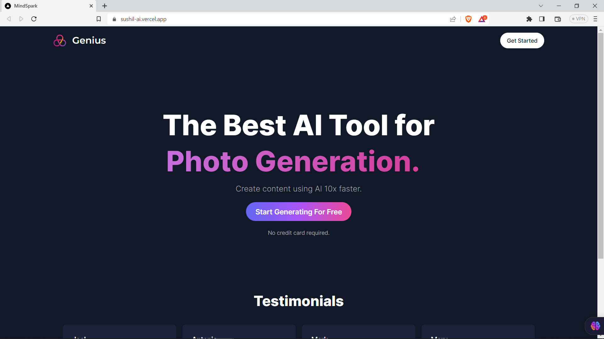
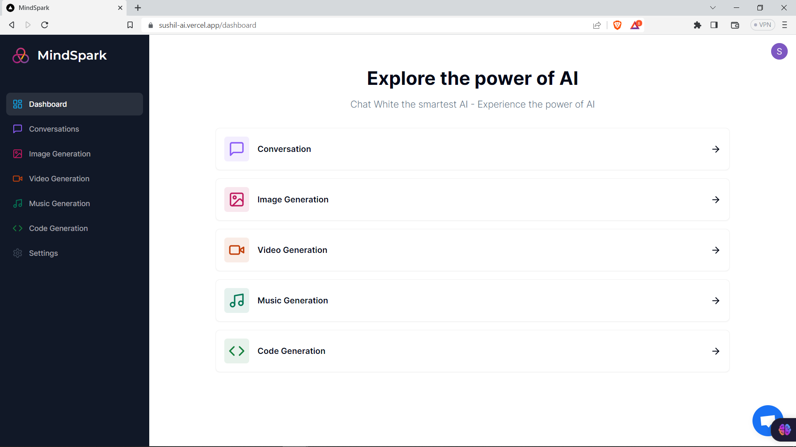

# Full Stack AI SAAS with Next.js 13, Clerk, Stripe, App Router, React, Crisp, Shadcn UI, Tailwind, Prisma, MySQL, Planet Scale, NextAuth 2023

#### [https://sushil-ai.vercel.app](https://sushil-ai.vercel.app)

### Features:

- I have used Shadcn UI for the AI-SASS web app!
- You will be able to log in using Clerk Authentication!
- Chat, Image, Music and video code prediction generator
- I have used OpenAI APIs for chat, image, and code generation, and Replicate APIs for video and music generation
- Free trial of up to 5 predictions on new account
- Pro membership to access unlimited ai prediction
- Responsive Web App with tailwind CSS
- I have added the crisp chat bot for customer support
- Stripe checkout subscription
- Stripe webhooks
- MySQL + Prisma + PlanetScale





### Prerequisites

**Node version 14.x**

### Cloning the repository

```shell
git clone https://github.com/iprime2/AI-SAAS
```

### Install packages

```shell
npm install
```

### Setup .env file

```
NEXT_PUBLIC_CLERK_PUBLISHABLE_KEY=
CLERK_SECRET_KEY=
NEXT_PUBLIC_CLERK_SIGN_IN_URL=
NEXT_PUBLIC_CLERK_SIGN_UP_URL=
NEXT_PUBLIC_CLERK_AFTER_SIGN_IN_URL=
NEXT_PUBLIC_CLERK_AFTER_SIGN_UP_URL=
OPENAI_API_KEY=
REPLICATE_API_KEY=
DATABASE_URL=
STRIPE_API_KEY=
NEXT_PUBLIC_APP_URL=
STRIPE_WEBHOOK_SECRET=
```
 
### Setup Prisma

```shell
npx prisma generate
npx prisma db push
```

### Start the app

```shell
npm run dev
```

## Available commands

Running commands with npm `npm run [command]`

| command         | description                              |
| :-------------- | :--------------------------------------- |
| `dev`           | Starts a development instance of the app |
| `lint`          | Check any javascript error               |
| `build`         | To build the webapp                      |
